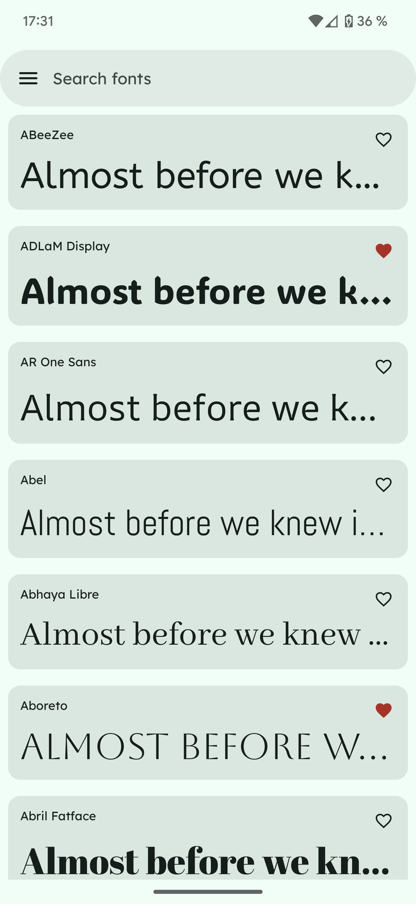

# Foundry

A Jetpack Compose app using Downloadable Google Fonts.

</br>
<p align="center">

</p>

## Setup

1. Create a `local.properties` file in root directory.
2. Add:

```
google_fonts_api_key=YOUR_GOOGLE_FONTS_API_KEY_HERE
```
